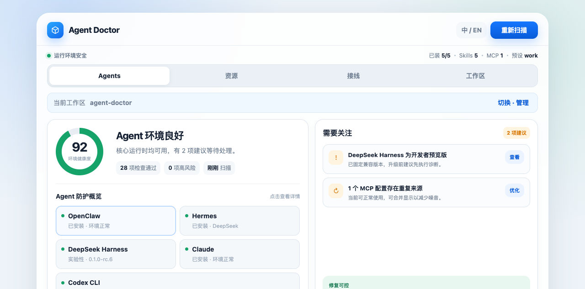

# Agent Doctor

**Diagnose, repair, and isolate local AI agent runtimes on one machine.**

Agent Doctor discovers OpenClaw, Hermes, DeepSeek Harness, Claude Code, Codex, and related runtimes, runs redacted probes to find misconfiguration, and repairs them with backups, typed actions, and audit reports.



**Personal (default):** CLI + desktop companion — when agents break, diagnose and fix them; keep projects from cross-contaminating. Wire your own endpoint if needed; this is ops repair, not a provider marketplace.

**Team (optional):** same client + [Evotown](https://github.com/EXboys/evotown) for compliance baseline, skill sync, policy, dispatch, and audit.

Product boundary: [docs/product-boundary.md](docs/product-boundary.md) · 中文：[docs/zh-CN/product-boundary.md](docs/zh-CN/product-boundary.md)

```bash
agent-doctor doctor                              # Diagnose: installed runtimes, config paths, gateway wiring
agent-doctor repair hermes                       # Repair: probes + safe preview (no writes)
agent-doctor repair hermes --apply               # Backup, rule playbook, re-probe, audit
agent-doctor repair hermes --rollback            # Restore latest backup (or --backup <id>)
agent-doctor ask hermes "why is the gateway down?"  # One-shot check via the runtime
agent-doctor workspace status                    # Project isolation / memory bleed
agent-doctor setup --url ... --key ...           # Onboard: apply company profile
agent-doctor connect                             # Stay online on Evotown (WS presence + inventory)
```

[License: MIT](LICENSE) · [Roadmap](docs/ROADMAP.md) · [Repair safety](docs/repair-safety.md)

---

## Desktop

The Tauri companion (tray + window) uses the same Rust core as the CLI. Typical loop: **scan → diagnose → confirm repair → Ask re-check**.

| Tab | What it does |
| --- | --- |
| **Agents** | Health score, runtime inventory, Diagnose → Repair → Ask drawer |
| **Resources** | Skills / MCP inventory, Browser MCP wiring into Codex / Claude / Hermes / OpenClaw |
| **Wiring** | Exclusive personal provider vs Evotown team mode |
| **Workspace** | Switch project isolation, remote VPS read-only doctor, Hermes scene presets |

```bash
cd desktop && npm install && npm run tauri dev
```

See [desktop/README.md](desktop/README.md).

---

## Team / Evotown (optional)

With **Evotown** (first-party control plane) — the **B** increment on top of doctor / repair / workspace:

```bash
agent-doctor setup --url https://your-evotown.example.com --key evk_...
agent-doctor sync          # Pull private SkillHub bundle
agent-doctor policy pull   # Cache policies locally
agent-doctor register --bootstrap-token <IT-token>  # Write evi_ for connect
agent-doctor connect       # WebSocket online + inventory + job.assign
```

See [docs/enterprise.md](docs/enterprise.md) and [docs/product-boundary.md](docs/product-boundary.md).

---

## Status

**v0.1.29** — CLI + desktop for local agent ops. Not 1.0; the core loop is usable.

**Shipped:** discovery and probes for OpenClaw, Hermes, DeepSeek Harness, Claude Code, and Codex; `repair --apply` / `--rollback` with backups; desktop Diagnose → Repair → Ask; workspace isolation; Browser MCP; exclusive personal / team mode; Evotown `setup` / `sync` / `connect`; read-only `remote` doctor over SSH.

**Not yet:** compliance report export, keychain API-key storage, remote repair over SSH, or auto-filling secrets. See [docs/ROADMAP.md](docs/ROADMAP.md).

Repair writes stay typed: backup first, no free-form shell, secrets redacted before AI analysis. Missing keys get a `.env` placeholder and a local guide — you paste the secret. — [docs/repair-safety.md](docs/repair-safety.md).

---

## Why Agent Doctor?

Developers and teams increasingly run **several** local AI agent runtimes:

| Runtime | Typical config |
| --- | --- |
| [OpenClaw](https://github.com/openclaw/openclaw) | `~/.openclaw/openclaw.json` |
| [Hermes Agent](https://github.com/nousresearch/hermes-agent) | `~/.hermes/config.yaml` |
| [DeepSeek Harness](https://github.com/deepseek-ai/deepseek-harness) (`dsh`) | `~/.dsh/settings.yaml` |
| [Claude Code](https://docs.anthropic.com/en/docs/claude-code) | `~/.claude/settings.json` |
| Codex CLI | `~/.codex/config.toml` |

Each runtime has its own install path, gateway settings, skills manifest, policy surface, and failure modes. Agent Doctor gives you **one** local client to answer:

- What is installed on this laptop?
- Where do configs live?
- Why did this agent stop working, and can we repair it safely?
- Are projects isolated (workspace), or is memory/MCP bleeding across them?
- *(Team)* Are runtimes pointed at the approved company gateway / baseline?
- *(Team)* What drifted from the team profile, and can we restore compliance?

```text
  Your laptop
 ┌──────────────────────────────────┐
 │ Agent Doctor                     │
 │ doctor · repair · ask · workspace│
 └──────────────┬───────────────────┘
                │
   OpenClaw · Hermes · DeepSeek Harness · Claude Code · Codex
```

---

## Relationship to other tools

| Project | Scope |
| --- | --- |
| **[ClawPanel](https://github.com/qingchencloud/clawpanel)** | Rich GUI for OpenClaw + Hermes |
| **[ClawPal](https://github.com/lay2dev/clawpal)** | OpenClaw desktop config companion |
| **Agent Doctor** | **Local runtime diagnosis, backup, repair, and project isolation; optional team compliance via Evotown** |

---

## 中文

**Agent Doctor** 在本机 **诊断、修复、隔离** AI Agent Runtime（OpenClaw、Hermes、DeepSeek Harness、Claude Code、Codex 等）。

- **个人（C）**：坏了能查、能修、项目不串味；可选个人 endpoint 接线（运维语义，非代理管家）。
- **团队（B）**：同客户端 + Evotown — 合规基线、同步、策略、派活、审计。

桌面是托盘 + 窗口：扫描 → 诊断 → 确认修复 → Ask 复验。产品边界：[docs/zh-CN/product-boundary.md](docs/zh-CN/product-boundary.md)。

```bash
agent-doctor doctor                              # 诊断
agent-doctor repair hermes                       # 修复预览（不写文件）
agent-doctor repair hermes --apply               # 备份 + 规则修复 + 复检
agent-doctor repair hermes --rollback            # 从备份恢复
agent-doctor ask hermes "网关为什么连不上？"
agent-doctor workspace status
agent-doctor setup --url ... --key ...           # 团队就位（Evotown）
```

团队可选：`sync`、`policy pull`、`connect` — 见 [docs/enterprise.md](docs/enterprise.md)。完整中文说明：[docs/zh-CN/README.md](docs/zh-CN/README.md)。

---

## Development

```bash
# CLI
cargo run -p agent-doctor -- doctor

# Local CI checks (fmt / clippy / test)
make check
# or: ./scripts/check.sh cli

# Desktop (requires Node.js)
cd desktop && npm install && npm run tauri dev
```

See [docs/development.md](docs/development.md), [docs/ROADMAP.md](docs/ROADMAP.md), [docs/install.md](docs/install.md), [cli/README.md](cli/README.md), [desktop/README.md](desktop/README.md), and [CONTRIBUTING.md](CONTRIBUTING.md).

## Install

Prebuilt CLI and desktop bundles are published to [GitHub Releases](https://github.com/EXboys/agent-doctor/releases).

```bash
# Latest CLI (pick the pattern for your OS — see docs/install.md)
gh release download --repo EXboys/agent-doctor --pattern 'agent-doctor-*-macos-arm64.tar.gz'
tar -xzf agent-doctor-*-macos-arm64.tar.gz && chmod +x agent-doctor
./agent-doctor doctor
```

## License

MIT — see [LICENSE](LICENSE).
